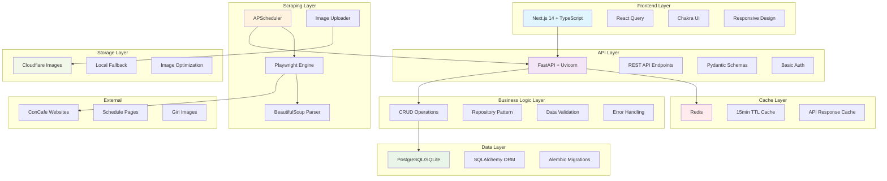
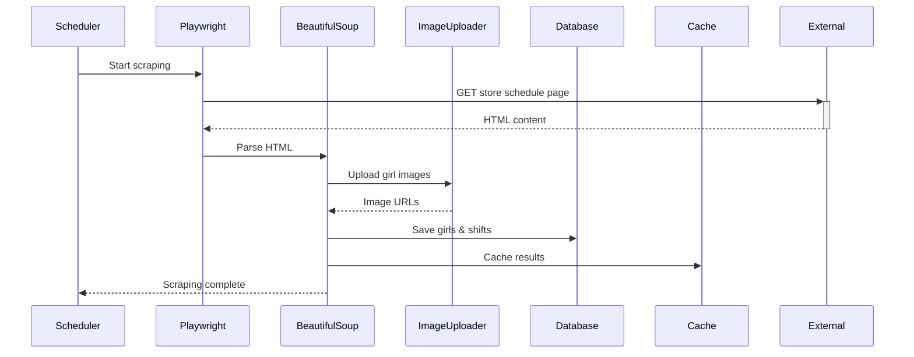
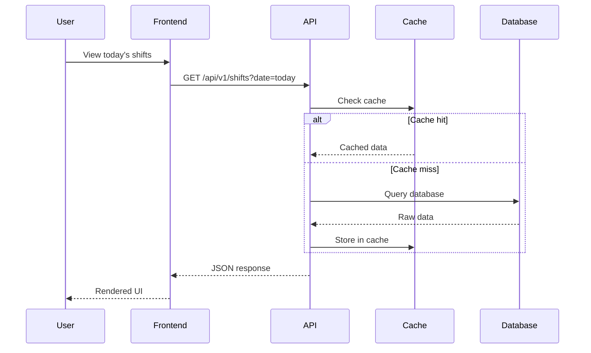

# ConCafe Shift Tracker - システムアーキテクチャ

## 概要

ConCafe Shift Tracker は、秋葉原エリアのコンカフェ嬢出勤情報を自動集約し、リアルタイムで表示するフルスタックWebアプリケーションです。

## アーキテクチャ図



## コンポーネント詳細

### 1. フロントエンド層 (Frontend Layer)

#### Next.js 14 + App Router
- **役割**: ユーザーインターフェースの提供
- **技術**: React 18, TypeScript, App Router
- **特徴**: 
  - Server-Side Rendering (SSR)
  - Static Site Generation (SSG)
  - SEO最適化

#### React Query
- **役割**: サーバー状態管理とキャッシング
- **機能**:
  - 自動バックグラウンド更新
  - Optimistic Updates
  - エラーハンドリング

#### Chakra UI
- **役割**: UIコンポーネントシステム
- **特徴**:
  - レスポンシブデザイン
  - アクセシビリティ対応
  - ダークモード対応

### 2. API層 (API Layer)

#### FastAPI
- **役割**: RESTful API サーバー
- **エンドポイント**:
  - `GET /api/v1/stores` - 店舗一覧
  - `GET /api/v1/shifts` - シフト情報
  - `GET /api/v1/girls` - 嬢情報
  - `POST /api/v1/admin/scrape` - 手動スクレイピング

#### 認証・認可
- **方式**: HTTP Basic認証
- **対象**: 管理者機能のみ
- **実装**: FastAPI Security

### 3. ビジネスロジック層 (Business Logic Layer)

#### Repository パターン
```python
class StoreRepository:
    @staticmethod
    def get_all(db: Session) -> List[Store]
    @staticmethod
    def create_or_update(db: Session, store_data: Dict)
```

#### データ検証
- **入力検証**: Pydantic スキーマ
- **出力検証**: レスポンスモデル
- **エラーハンドリング**: HTTPException

### 4. スクレイピング層 (Scraping Layer)

#### APScheduler
- **実行間隔**: 5分ごと
- **ジョブ管理**: 非同期実行
- **エラー処理**: 失敗時のリトライ

#### Playwright Engine
```python
async def scrape_store(browser: Browser, store_config: Dict):
    page = await browser.new_page()
    await page.goto(store_config["url"])
    html = await page.content()
    return parse_html(html)
```

#### BeautifulSoup Parser
- **HTML解析**: CSS セレクター
- **データ抽出**: 嬢名、画像、シフト時間
- **正規化**: 時間フォーマット統一

### 5. データ層 (Data Layer)

#### データベーススキーマ
```sql
-- 店舗テーブル
CREATE TABLE stores (
    id VARCHAR PRIMARY KEY,
    name VARCHAR NOT NULL,
    url VARCHAR NOT NULL,
    area VARCHAR NOT NULL,
    selectors TEXT NOT NULL,
    created_at TIMESTAMP DEFAULT NOW()
);

-- 嬢テーブル
CREATE TABLE girls (
    id SERIAL PRIMARY KEY,
    store_id VARCHAR REFERENCES stores(id),
    name VARCHAR NOT NULL,
    image_url VARCHAR,
    status VARCHAR DEFAULT 'active',
    first_seen TIMESTAMP DEFAULT NOW(),
    last_seen TIMESTAMP DEFAULT NOW()
);

-- シフトテーブル
CREATE TABLE shifts (
    id SERIAL PRIMARY KEY,
    store_id VARCHAR REFERENCES stores(id),
    girl_id INTEGER REFERENCES girls(id),
    date DATE NOT NULL,
    start_time TIME NOT NULL,
    end_time TIME NOT NULL,
    scraped_at TIMESTAMP DEFAULT NOW()
);
```

### 6. キャッシュ層 (Cache Layer)

#### Redis キャッシュ戦略
```python
# キャッシュキー設計
cache_keys = {
    "shifts_by_date": "shifts_by_date:{date}:{store_id}",
    "store_shifts": "store_shifts:{store_id}:{start_date}:{end_date}",
    "girl_detail": "girl_detail:{girl_id}",
    "new_girls_today": "new_girls_today:{date}"
}

# TTL設定
ttl_settings = {
    "shifts_by_date": 300,      # 5分
    "store_shifts": 600,        # 10分
    "girl_detail": 1800,        # 30分
    "new_girls_today": 3600     # 1時間
}
```

### 7. ストレージ層 (Storage Layer)

#### Cloudflare Images
- **用途**: 嬢の顔写真保存
- **機能**: 自動リサイズ、最適化
- **フォールバック**: ローカルストレージ

#### ローカルストレージ
- **開発環境**: `frontend/public/images/`
- **ファイル命名**: `{store_id}_{girl_name}_{hash}.jpg`

## データフロー

### 1. スクレイピングフロー


### 2. API リクエストフロー


## スケーラビリティ考慮事項

### 1. 水平スケーリング
- **API サーバー**: ロードバランサー + 複数インスタンス
- **データベース**: Read Replica対応
- **キャッシュ**: Redis Cluster

### 2. パフォーマンス最適化
- **フロントエンド**: CDN配信、画像最適化
- **API**: レスポンス圧縮、ページネーション
- **データベース**: インデックス最適化

### 3. 可用性
- **ヘルスチェック**: `/health` エンドポイント
- **エラー処理**: Graceful degradation
- **監視**: ログ集約、メトリクス収集

## セキュリティ考慮事項

### 1. 認証・認可
- **管理者機能**: Basic認証
- **API アクセス**: CORS設定
- **入力検証**: Pydantic スキーマ

### 2. データ保護
- **個人情報**: ニックネームと画像URLのみ
- **通信**: HTTPS強制
- **データベース**: 接続文字列暗号化

### 3. レート制限
- **スクレイピング**: 5分間隔制限
- **API**: IPベース制限考慮
- **画像アップロード**: サイズ制限

## 監視・運用

### 1. ログ設定
```python
logging_config = {
    "version": 1,
    "handlers": {
        "default": {
            "level": "INFO",
            "class": "logging.StreamHandler",
            "formatter": "default"
        }
    },
    "loggers": {
        "app.scraper": {"level": "DEBUG"},
        "app.api": {"level": "INFO"}
    }
}
```

### 2. メトリクス
- **スクレイピング成功率**
- **API レスポンス時間**
- **キャッシュヒット率**
- **データベース接続プール**

### 3. アラート
- **スクレイピング失敗**
- **API エラー率上昇**
- **データベース接続失敗**
- **ディスク使用量**

## 技術的制約と今後の改善点

### 1. 現在の制約
- **スクレイピング対象**: 3店舗のみ
- **同時実行数**: 最大3並列
- **画像ストレージ**: Cloudflare Images依存

### 2. 改善案
- **機械学習**: 嬢の顔認識による重複排除
- **リアルタイム**: WebSocket対応
- **多言語対応**: i18n実装
- **モバイルアプリ**: PWA対応

### 3. 技術負債
- **テストカバレッジ**: 70%以上を目標
- **ドキュメント**: API仕様書自動生成
- **CI/CD**: GitHub Actions導入